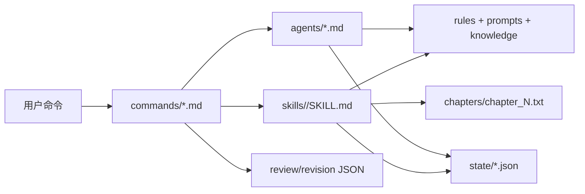

# StoryWeaver 插件架构

StoryWeaver 当前不是独立 Web/Electron 应用，而是 Claude Code 插件。它通过插件组件向 Claude Code 注入命令、技能和智能体，由 Claude Code 的文件工具读写本地小说项目。

## 组件

| 组件 | 路径 | 作用 |
|------|------|------|
| Manifest | `.claude-plugin/plugin.json` | 声明插件身份、命令、技能、智能体 |
| Commands | `commands/*.md` | 用户显式调用的 `/storyweaver:<command>` 工作流 |
| Skills | `skills/<name>/SKILL.md` | Claude 自动或手动调用的能力包 |
| Agents | `agents/*.md` | 可委派的规划、写作、校验、提取、世界观角色 |
| Rules | `rules/` | 被命令、技能、智能体引用的约束 |
| Prompts | `prompts/` | 生成、提取、校验模板 |
| Schemas | `schemas/` | 状态 JSON Schema，约束可写入的状态形状 |
| Examples | `examples/minimal-project/` | 可校验的最小项目样例 |
| Tools | `tools/` | 插件验证、状态图校验、项目初始化器、状态卡管理器、故事图谱管理器、outline 规划器、brief 构建器、extraction 构建器、index 构建器、正文导入器、章节 gate、快照与恢复 |
| State | `state/` | 小说项目的分布式 JSON 状态 |
| Chapters | `chapters/` | 章节正文 |

## 数据流

## 关键约束

- 插件命令安装后以 `/storyweaver:<command>` 暴露。
- `CLAUDE.md` 不会作为插件上下文自动加载；可分发上下文必须放进技能、命令或 agent。
- `rules/` 不是 Claude Code manifest 的插件组件；需要由技能、命令或 agent 明确引用。
- `state/` 是故事状态唯一真源。
- `state/metadata/index.json` 是可重建导航索引，只用于概览、反向引用和健康提示。
- `snapshots/` 是本地恢复点，不属于当前事实图；不要把旧快照放进 `state/`。
- `schemas/` 是状态结构的机器校验真源；修改状态形状必须同步 schema 和样例。
- 插件目录可能被 Claude Code 复制到缓存中，因此技能中引用插件内资源时优先使用 `${CLAUDE_PLUGIN_ROOT}`。
- 写入用户小说项目时使用 `${CLAUDE_PROJECT_DIR}` 或相对当前项目根的路径。

## 创作流水线

1. 初始化项目与状态目录。
2. 如已有旧稿/存稿，先导入正文并生成章节契约。
3. 使用雪花法生成作品蓝图。
4. 建立世界观、角色、组织、概念、情节线、时间线事件和关系网络。
5. 为目标章节建立章节契约。
6. 生成章节上下文包 `brief.json`。
7. 写作或扩写章节正文。
8. 生成 extraction 报告，提取状态增量并更新分布式 JSON。
9. 十三维一致性校验。
10. 生成行动队列和章节 gate，确认无 critical 后推进章节状态。
11. 根据报告修订；修订或覆盖写入前创建快照。
12. 重建状态索引并进入下一章。
